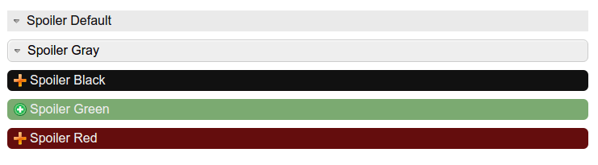

# Spoiler



Spolier plugin for [fansoro](https://github.com/fansoro/fansoro)

## Installation
See [this instruction](http://fansoro.org/documentation/plugins/plugins-installation)

## Usage
```
{spoiler title="Spoiler Default"} text here {/spoiler}

{spoiler title="Spoiler Gray" class="sp-gray"} text here {/spoiler}

{spoiler title="Spoiler Black" class="sp-black"} text here {/spoiler}

{spoiler title="Spoiler Green" class="sp-green"} text here {/spoiler}

{spoiler title="Spoiler Red" class="sp-red"} text here {/spoiler}
```

## License
See [LICENSE](https://github.com/fansoro/fansoro-plugin-spolier/blob/master/LICENSE)
